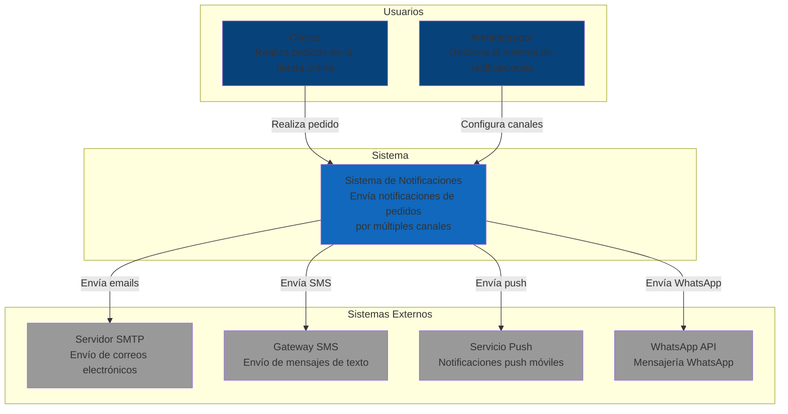

# C1 - Diagrama de Contexto - Sistema de Notificaciones

## Nivel 1: Contexto del Sistema

```mermaid
graph TB
    subgraph Usuarios
        Cliente[Cliente<br/>Realiza pedidos en la tienda online]
        Admin[Administrador<br/>Gestiona el sistema de notificaciones]
    end
    
    subgraph Sistema
        NotifSystem[Sistema de Notificaciones<br/>Envía notificaciones de pedidos<br/>por múltiples canales]
    end
    
    subgraph Externos[Sistemas Externos]
        EmailServer[Servidor SMTP<br/>Envío de correos electrónicos]
        SMSGateway[Gateway SMS<br/>Envío de mensajes de texto]
        PushService[Servicio Push<br/>Notificaciones push móviles]
        WhatsAppAPI[WhatsApp API<br/>Mensajería WhatsApp]
    end
    
    Cliente -->|Realiza pedido| NotifSystem
    Admin -->|Configura canales| NotifSystem
    NotifSystem -->|Envía emails| EmailServer
    NotifSystem -->|Envía SMS| SMSGateway
    NotifSystem -->|Envía push| PushService
    NotifSystem -->|Envía WhatsApp| WhatsAppAPI
    
    style Cliente fill:#08427B
    style Admin fill:#08427B
    style NotifSystem fill:#1168BD
    style EmailServer fill:#999999
    style SMSGateway fill:#999999
    style PushService fill:#999999
    style WhatsAppAPI fill:#999999
```
