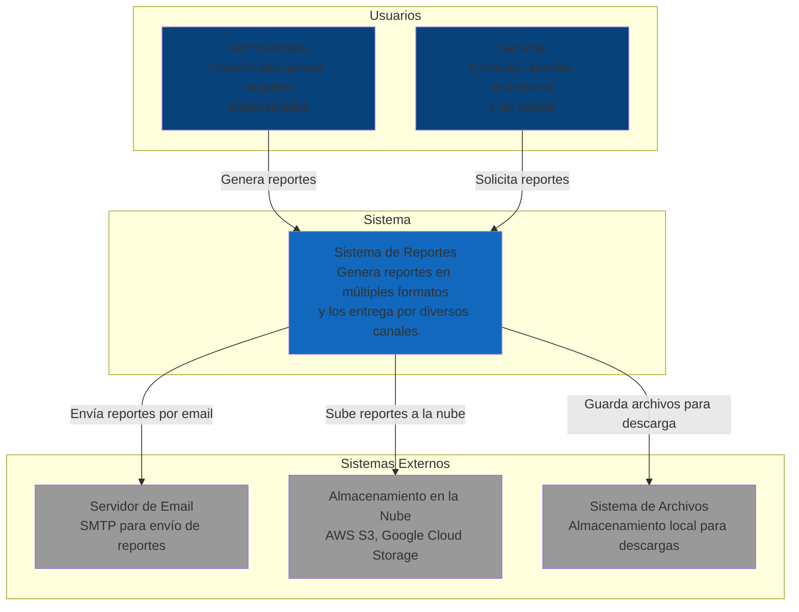

# C1 - Diagrama de Contexto - Sistema de Generación de Reportes

## Nivel 1: Contexto del Sistema

```mermaid
graph TB
    subgraph Usuarios
        Admin[Administrador<br/>Usuario que genera reportes<br/>empresariales]
        Gerente[Gerente<br/>Consulta reportes financieros<br/>y de ventas]
    end
    
    subgraph Sistema
        ReportSystem[Sistema de Reportes<br/>Genera reportes en múltiples formatos<br/>y los entrega por diversos canales]
    end
    
    subgraph Externos[Sistemas Externos]
        EmailServer[Servidor de Email<br/>SMTP para envío de reportes]
        CloudStorage[Almacenamiento en la Nube<br/>AWS S3, Google Cloud Storage]
        FileSystem[Sistema de Archivos<br/>Almacenamiento local para descargas]
    end
    
    Admin -->|Genera reportes| ReportSystem
    Gerente -->|Solicita reportes| ReportSystem
    ReportSystem -->|Envía reportes por email| EmailServer
    ReportSystem -->|Sube reportes a la nube| CloudStorage
    ReportSystem -->|Guarda archivos para descarga| FileSystem
    
    style Admin fill:#08427B
    style Gerente fill:#08427B
    style ReportSystem fill:#1168BD
    style EmailServer fill:#999999
    style CloudStorage fill:#999999
    style FileSystem fill:#999999
```
