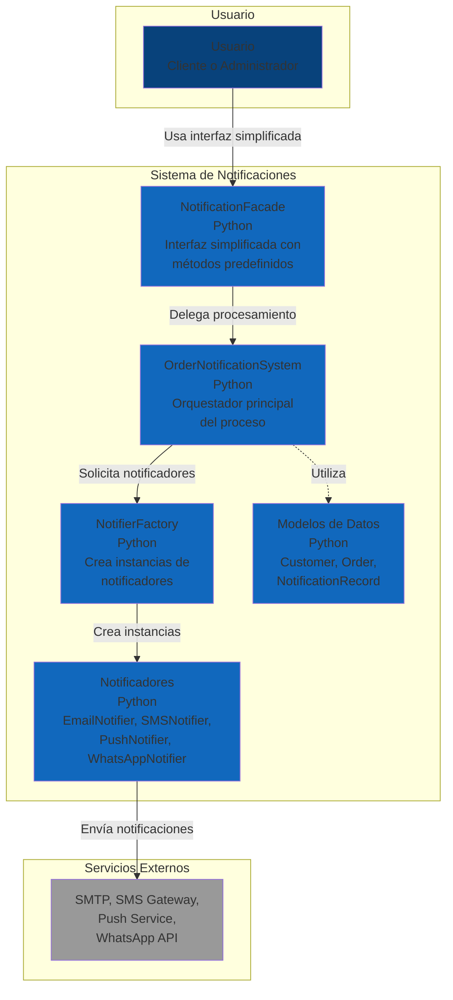

# C2 - Diagrama de Contenedores - Sistema de Notificaciones

## Nivel 2: Contenedores del Sistema

```mermaid
graph TB
    subgraph Usuario
        User[Usuario<br/>Cliente o Administrador]
    end
    
    subgraph SistemaNotificaciones[Sistema de Notificaciones]
        Facade[NotificationFacade<br/>Python<br/>Interfaz simplificada con<br/>métodos predefinidos]
        Core[OrderNotificationSystem<br/>Python<br/>Orquestador principal<br/>del proceso]
        Notifiers[Notificadores<br/>Python<br/>EmailNotifier, SMSNotifier,<br/>PushNotifier, WhatsAppNotifier]
        Factory[NotifierFactory<br/>Python<br/>Crea instancias de<br/>notificadores]
        Models[Modelos de Datos<br/>Python<br/>Customer, Order,<br/>NotificationRecord]
    end
    
    subgraph Externos[Servicios Externos]
        External[SMTP, SMS Gateway,<br/>Push Service,<br/>WhatsApp API]
    end
    
    User -->|Usa interfaz simplificada| Facade
    Facade -->|Delega procesamiento| Core
    Core -->|Solicita notificadores| Factory
    Factory -->|Crea instancias| Notifiers
    Core -.->|Utiliza| Models
    Notifiers -->|Envía notificaciones| External
    
    style User fill:#08427B
    style Facade fill:#1168BD
    style Core fill:#1168BD
    style Notifiers fill:#1168BD
    style Factory fill:#1168BD
    style Models fill:#1168BD
    style External fill:#999999
```
