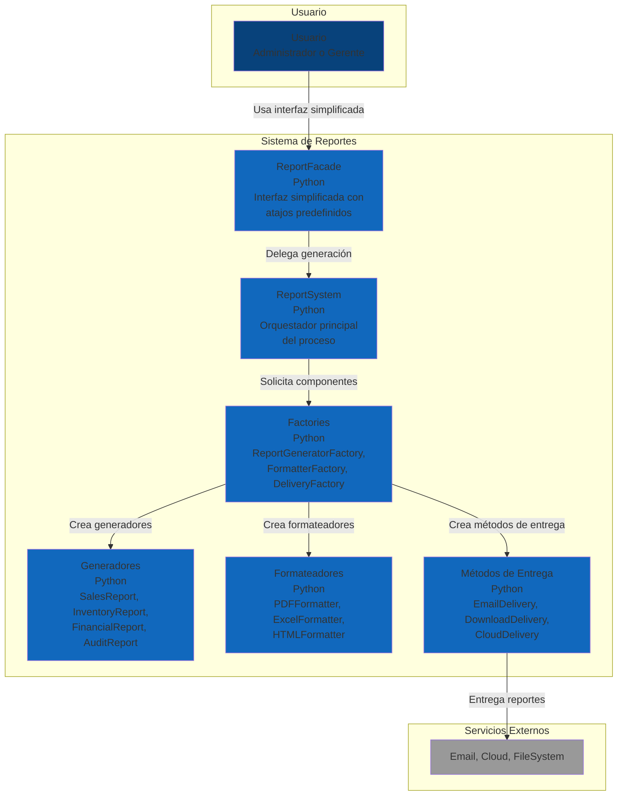

# C2 - Diagrama de Contenedores - Sistema de Generación de Reportes

## Nivel 2: Contenedores del Sistema

```mermaid
graph TB
    subgraph Usuario
        User[Usuario<br/>Administrador o Gerente]
    end
    
    subgraph SistemaReportes[Sistema de Reportes]
        Facade[ReportFacade<br/>Python<br/>Interfaz simplificada con<br/>atajos predefinidos]
        Core[ReportSystem<br/>Python<br/>Orquestador principal<br/>del proceso]
        Generators[Generadores<br/>Python<br/>SalesReport, InventoryReport,<br/>FinancialReport, AuditReport]
        Formatters[Formateadores<br/>Python<br/>PDFFormatter, ExcelFormatter,<br/>HTMLFormatter]
        Delivery[Métodos de Entrega<br/>Python<br/>EmailDelivery, DownloadDelivery,<br/>CloudDelivery]
        Factories[Factories<br/>Python<br/>ReportGeneratorFactory,<br/>FormatterFactory, DeliveryFactory]
    end
    
    subgraph Externos[Servicios Externos]
        External[Email, Cloud, FileSystem]
    end
    
    User -->|Usa interfaz simplificada| Facade
    Facade -->|Delega generación| Core
    Core -->|Solicita componentes| Factories
    Factories -->|Crea generadores| Generators
    Factories -->|Crea formateadores| Formatters
    Factories -->|Crea métodos de entrega| Delivery
    Delivery -->|Entrega reportes| External
    
    style User fill:#08427B
    style Facade fill:#1168BD
    style Core fill:#1168BD
    style Generators fill:#1168BD
    style Formatters fill:#1168BD
    style Delivery fill:#1168BD
    style Factories fill:#1168BD
    style External fill:#999999
```
