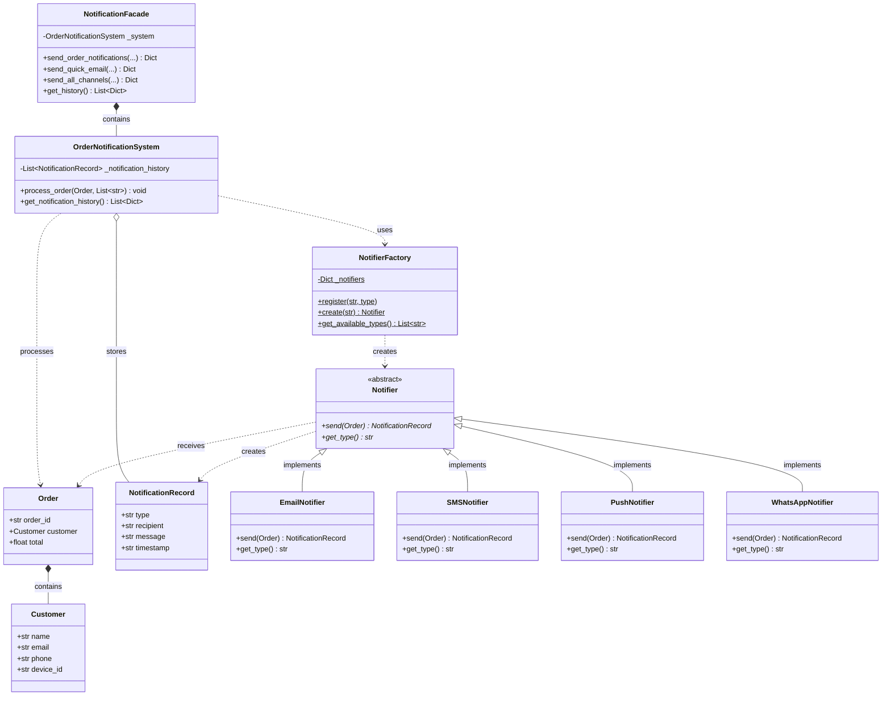

```mermaid
classDiagram
    direction TB
    
    %% ==================== ENTIDADES ====================
    class Customer {
        +str name
        +str email
        +str phone
        +str device_id
    }
    
    class Order {
        +str order_id
        +Customer customer
        +float total
    }
    
    class NotificationRecord {
        +str type
        +str recipient
        +str message
        +str timestamp
    }
    
    %% ==================== STRATEGY PATTERN ====================
    class Notifier {
        <<abstract>>
        +send(Order) NotificationRecord*
        +get_type() str*
    }
    
    class EmailNotifier {
        +send(Order) NotificationRecord
        +get_type() str
    }
    
    class SMSNotifier {
        +send(Order) NotificationRecord
        +get_type() str
    }
    
    class PushNotifier {
        +send(Order) NotificationRecord
        +get_type() str
    }
    
    class WhatsAppNotifier {
        +send(Order) NotificationRecord
        +get_type() str
    }
    
    %% ==================== FACTORY PATTERN ====================
    class NotifierFactory {
        -Dict _notifiers$
        +register(str, type)$
        +create(str) Notifier$
        +get_available_types() List~str~$
    }
    
    %% ==================== CORE SYSTEM ====================
    class OrderNotificationSystem {
        -List~NotificationRecord~ _notification_history
        +process_order(Order, List~str~) void
        +get_notification_history() List~Dict~
    }
    
    %% ==================== FACADE PATTERN ====================
    class NotificationFacade {
        -OrderNotificationSystem _system
        +send_order_notifications(...) Dict
        +send_quick_email(...) Dict
        +send_all_channels(...) Dict
        +get_history() List~Dict~
    }
    
    %% ==================== RELACIONES ====================
    Notifier <|-- EmailNotifier : implements
    Notifier <|-- SMSNotifier : implements
    Notifier <|-- PushNotifier : implements
    Notifier <|-- WhatsAppNotifier : implements
    
    NotifierFactory ..> Notifier : creates
    
    OrderNotificationSystem ..> NotifierFactory : uses
    OrderNotificationSystem o-- NotificationRecord : stores
    OrderNotificationSystem ..> Order : processes
    
    NotificationFacade *-- OrderNotificationSystem : contains
    
    Order *-- Customer : contains
    Notifier ..> Order : receives
    Notifier ..> NotificationRecord : creates
```