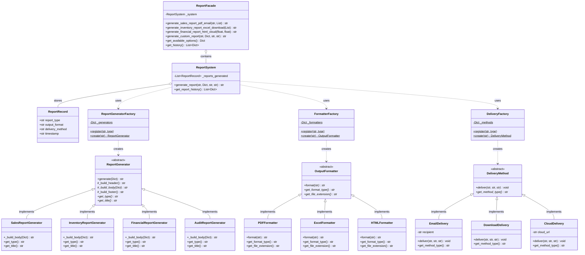

```mermaid
classDiagram
    direction TB
    
    %% ==================== ENTIDAD ====================
    class ReportRecord {
        +str report_type
        +str output_format
        +str delivery_method
        +str timestamp
    }
    
    %% ==================== TEMPLATE METHOD + STRATEGY: Generadores ====================
    class ReportGenerator {
        <<abstract>>
        +generate(Dict) str
        #_build_header() str
        #_build_body(Dict) str*
        #_build_footer() str
        +get_type() str*
        +get_title() str*
    }
    
    class SalesReportGenerator {
        +_build_body(Dict) str
        +get_type() str
        +get_title() str
    }
    
    class InventoryReportGenerator {
        +_build_body(Dict) str
        +get_type() str
        +get_title() str
    }
    
    class FinancialReportGenerator {
        +_build_body(Dict) str
        +get_type() str
        +get_title() str
    }
    
    class AuditReportGenerator {
        +_build_body(Dict) str
        +get_type() str
        +get_title() str
    }
    
    %% ==================== STRATEGY: Formateadores ====================
    class OutputFormatter {
        <<abstract>>
        +format(str) str*
        +get_format_type() str*
        +get_file_extension() str*
    }
    
    class PDFFormatter {
        +format(str) str
        +get_format_type() str
        +get_file_extension() str
    }
    
    class ExcelFormatter {
        +format(str) str
        +get_format_type() str
        +get_file_extension() str
    }
    
    class HTMLFormatter {
        +format(str) str
        +get_format_type() str
        +get_file_extension() str
    }
    
    %% ==================== STRATEGY: Métodos de Entrega ====================
    class DeliveryMethod {
        <<abstract>>
        +deliver(str, str, str) void*
        +get_method_type() str*
    }
    
    class EmailDelivery {
        -str recipient
        +deliver(str, str, str) void
        +get_method_type() str
    }
    
    class DownloadDelivery {
        +deliver(str, str, str) void
        +get_method_type() str
    }
    
    class CloudDelivery {
        -str cloud_url
        +deliver(str, str, str) void
        +get_method_type() str
    }
    
    %% ==================== FACTORY PATTERN ====================
    class ReportGeneratorFactory {
        -Dict _generators$
        +register(str, type)$
        +create(str) ReportGenerator$
    }
    
    class FormatterFactory {
        -Dict _formatters$
        +register(str, type)$
        +create(str) OutputFormatter$
    }
    
    class DeliveryFactory {
        -Dict _methods$
        +register(str, type)$
        +create(str) DeliveryMethod$
    }
    
    %% ==================== CORE SYSTEM ====================
    class ReportSystem {
        -List~ReportRecord~ _reports_generated
        +generate_report(str, Dict, str, str) str
        +get_report_history() List~Dict~
    }
    
    %% ==================== FACADE PATTERN ====================
    class ReportFacade {
        -ReportSystem _system
        +generate_sales_report_pdf_email(str, List) str
        +generate_inventory_report_excel_download(List) str
        +generate_financial_report_html_cloud(float, float) str
        +generate_custom_report(str, Dict, str, str) str
        +get_available_options() Dict
        +get_history() List~Dict~
    }
    
    %% ==================== RELACIONES: Generadores ====================
    ReportGenerator <|-- SalesReportGenerator : implements
    ReportGenerator <|-- InventoryReportGenerator : implements
    ReportGenerator <|-- FinancialReportGenerator : implements
    ReportGenerator <|-- AuditReportGenerator : implements
    
    %% ==================== RELACIONES: Formateadores ====================
    OutputFormatter <|-- PDFFormatter : implements
    OutputFormatter <|-- ExcelFormatter : implements
    OutputFormatter <|-- HTMLFormatter : implements
    
    %% ==================== RELACIONES: Delivery ====================
    DeliveryMethod <|-- EmailDelivery : implements
    DeliveryMethod <|-- DownloadDelivery : implements
    DeliveryMethod <|-- CloudDelivery : implements
    
    %% ==================== RELACIONES: Factories ====================
    ReportGeneratorFactory ..> ReportGenerator : creates
    FormatterFactory ..> OutputFormatter : creates
    DeliveryFactory ..> DeliveryMethod : creates
    
    %% ==================== RELACIONES: Core ====================
    ReportSystem ..> ReportGeneratorFactory : uses
    ReportSystem ..> FormatterFactory : uses
    ReportSystem ..> DeliveryFactory : uses
    ReportSystem o-- ReportRecord : stores
    
    %% ==================== RELACIONES: Facade ====================
    ReportFacade o-- ReportSystem : contains
```
