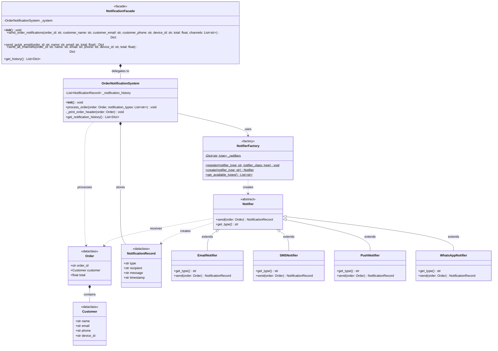
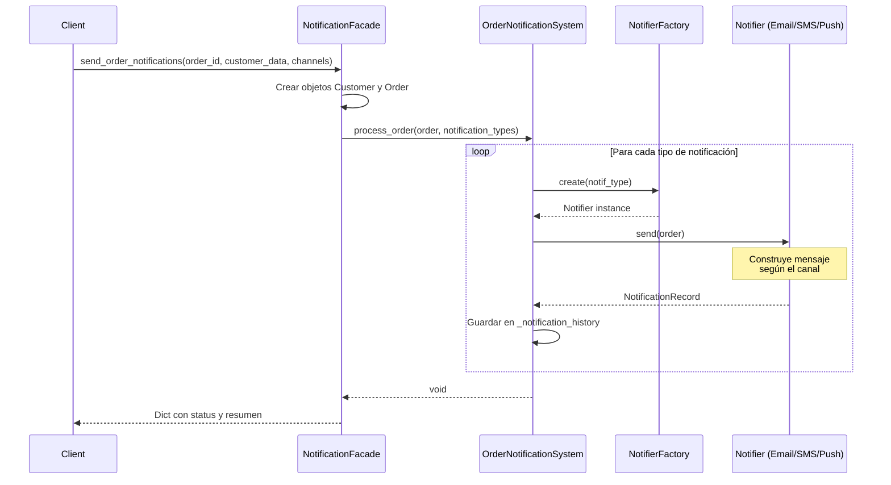

# C4 - Diagrama de Código - Sistema de Notificaciones

Nivel más detallado mostrando las clases, métodos y atributos del sistema.

## Diagrama de Clases Detallado

```mermaid
classDiagram
    direction TB
    
    %% ==================== DATACLASSES ====================
    class Customer {
        <<dataclass>>
        +str name
        +str email
        +str phone
        +str device_id
    }
    
    class Order {
        <<dataclass>>
        +str order_id
        +Customer customer
        +float total
    }
    
    class NotificationRecord {
        <<dataclass>>
        +str type
        +str recipient
        +str message
        +str timestamp
    }
    
    %% ==================== STRATEGY - NOTIFIERS ====================
    class Notifier {
        <<abstract>>
        +send(order: Order) NotificationRecord*
        +get_type() str*
    }
    
    class EmailNotifier {
        +get_type() str
        +send(order: Order) NotificationRecord
    }
    
    class SMSNotifier {
        +get_type() str
        +send(order: Order) NotificationRecord
    }
    
    class PushNotifier {
        +get_type() str
        +send(order: Order) NotificationRecord
    }
    
    class WhatsAppNotifier {
        +get_type() str
        +send(order: Order) NotificationRecord
    }
    
    %% ==================== FACTORY ====================
    class NotifierFactory {
        <<factory>>
        -Dict~str, type~ _notifiers$
        +register(notifier_type: str, notifier_class: type)$ void
        +create(notifier_type: str)$ Notifier
        +get_available_types()$ List~str~
    }
    
    %% ==================== CORE SYSTEM ====================
    class OrderNotificationSystem {
        -List~NotificationRecord~ _notification_history
        +__init__() void
        +process_order(order: Order, notification_types: List~str~) void
        -_print_order_header(order: Order) void
        +get_notification_history() List~Dict~
    }
    
    %% ==================== FACADE ====================
    class NotificationFacade {
        <<facade>>
        -OrderNotificationSystem _system
        +__init__() void
        +send_order_notifications(order_id: str, customer_name: str, customer_email: str, customer_phone: str, device_id: str, total: float, channels: List~str~) Dict
        +send_quick_email(order_id: str, name: str, email: str, total: float) Dict
        +send_all_channels(order_id: str, name: str, email: str, phone: str, device_id: str, total: float) Dict
        +get_history() List~Dict~
    }
    
    %% ==================== INHERITANCE ====================
    Notifier <|-- EmailNotifier : extends
    Notifier <|-- SMSNotifier : extends
    Notifier <|-- PushNotifier : extends
    Notifier <|-- WhatsAppNotifier : extends
    
    %% ==================== ASSOCIATIONS ====================
    NotifierFactory ..> Notifier : creates
    
    OrderNotificationSystem --> NotifierFactory : uses
    OrderNotificationSystem *-- NotificationRecord : stores
    OrderNotificationSystem ..> Order : processes
    
    NotificationFacade *-- OrderNotificationSystem : delegates to
    
    Order *-- Customer : contains
    Notifier ..> Order : receives
    Notifier ..> NotificationRecord : creates
```

## Flujo de Ejecución

```mermaid
sequenceDiagram
    participant Client
    participant Facade as NotificationFacade
    participant System as OrderNotificationSystem
    participant Factory as NotifierFactory
    participant Notifier as Notifier (Email/SMS/Push)
    
    Client->>Facade: send_order_notifications(order_id, customer_data, channels)
    Facade->>Facade: Crear objetos Customer y Order
    Facade->>System: process_order(order, notification_types)
    
    loop Para cada tipo de notificación
        System->>Factory: create(notif_type)
        Factory-->>System: Notifier instance
        
        System->>Notifier: send(order)
        Note over Notifier: Construye mensaje<br/>según el canal
        Notifier-->>System: NotificationRecord
        
        System->>System: Guardar en _notification_history
    end
    
    System-->>Facade: void
    Facade-->>Client: Dict con status y resumen
```